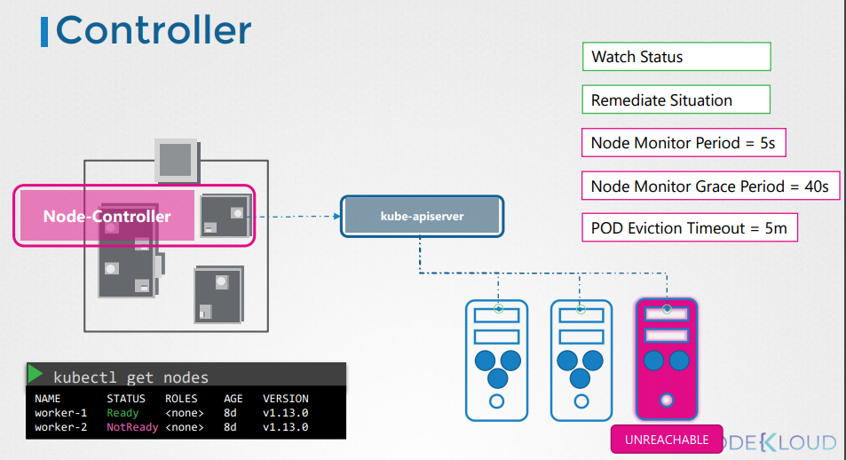
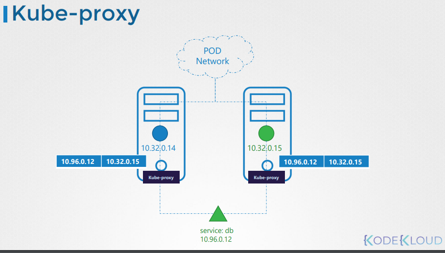

# 云原生-CKA笔记：Kubernetes 集群

## 集群结构

https://kubernetes.io/docs/concepts/architecture/

## Kubernetes 主要组件

#### Etcd

简介
* https://github.com/etcd-io/etcd
* https://etcd.io/docs/v3.5/quickstart/
* https://github.com/kodekloudhub/certified-kubernetes-administrator-course/blob/master/docs/02-Core-Concepts/03-ETCD-For-Beginners.md
* https://github.com/kodekloudhub/certified-kubernetes-administrator-course/blob/master/docs/02-Core-Concepts/04-ETCD-in-Kubernetes.md

在Kubernetes中的作用

快速开始

相关操作

#### Kube-APIServer

* https://kubernetes.io/docs/reference/command-line-tools-reference/kube-apiserver/

主要作用

* https://github.com/kodekloudhub/certified-kubernetes-administrator-course/blob/master/docs/02-Core-Concepts/05-Kube-API-Server.md

重要参数

#### Kube-ControllerManager

* https://kubernetes.io/docs/reference/command-line-tools-reference/kube-controller-manager/

**Node Controller**

**Replication Controller**

**Other Controllers**

重要参数

#### Kube-Scheduler

* https://kubernetes.io/docs/reference/command-line-tools-reference/kube-scheduler/
* https://kubernetes.io/docs/tasks/extend-kubernetes/configure-multiple-schedulers/

重要参数

#### Kubelet

* https://kubernetes.io/docs/reference/command-line-tools-reference/kubelet/

重要参数

#### Kube-Proxy

* https://kubernetes.io/docs/reference/command-line-tools-reference/kube-proxy/

## kubeadm 

## 网络方案

# Kubernetes 常用资源

## Pod

简介

#### 常见操作

## ReplicaSets

## Deployments

* https://kubernetes.io/zh/docs/concepts/workloads/controllers/deployment/

## Namespaces

* https://kubernetes.io/docs/concepts/overview/working-with-objects/namespaces/

## Services

* https://kubernetes.io/docs/concepts/services-networking/service/

#### ClusterIP

## 相关链接

* https://kubernetes.io/docs/concepts/overview/components/
* https://kubernetes.io/docs/tasks/administer-cluster/configure-upgrade-etcd/
* https://kubernetes.io/docs/setup/production-environment/tools/kubeadm/setup-ha-etcd-with-kubeadm/
* https://kubernetes.io/docs/setup/production-environment/tools/kubeadm/high-availability/#stacked-control-plane-and-etcd-nodes
* https://kubernetes.io/docs/setup/production-environment/tools/kubeadm/high-availability/#external-etcd-nodes

* https://kubernetes.io/docs/concepts/architecture/
* https://github.com/etcd-io/etcd
* https://etcd.io/docs/v3.5/quickstart/

集群管理
	安装
	升级
	备份、恢复
	证书
	高可用
	网络方案
	控制平面组件 
		安装
		配置
		日志
		监控
	排错